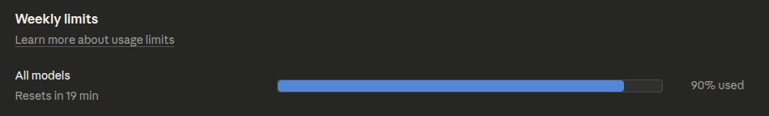
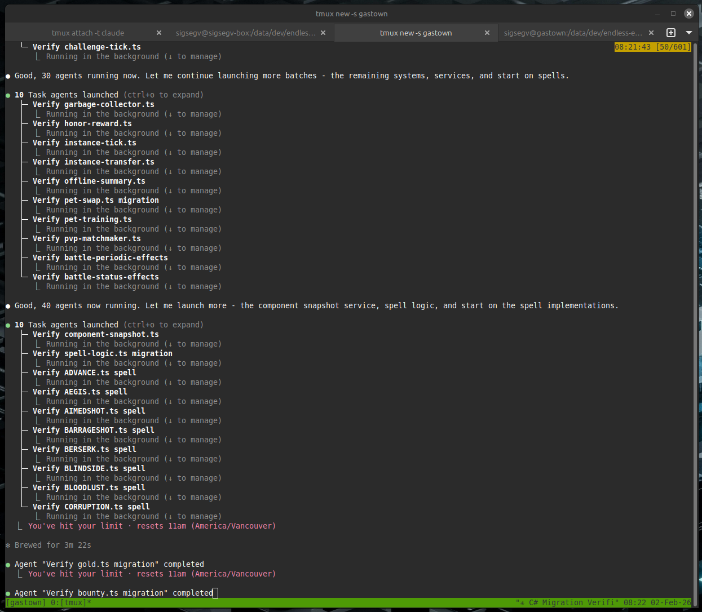

## Preface

Around 2020 I was working on a game called Endless Expedition. At the time, it was easy to work on both the backend and frontend at the same time using TypeScript. This allowed code sharing of common structures; for example, I was using an Entity-Component-System design and it is very useful to share the Component structure between server and client so that they can efficiently pass updates without building multiple DTOs.

After about a year, I ran out of steam working on the game, and since, I maybe commit one thing here and there, but on average less than 1 commit per month. Pretty typical for game development, I imagine!

In early 2026 I wanted to test out some medium-sized tasks for my "Claude Max 5x" subscription to see if I can get some useful things out of it. One thing that came to mind was getting some more regular progress on the game; a revival of sorts.

Being a new father I don't have a lot of time to sit around at the computer and type things, so I set up what appears to be a common-but-effective pattern to do development on my phone:
- a Tailscale network to bridge my Linux desktop at home with my phone
- `tmux` sessions on the desktop
- the Termux app on my Android phone

The general idea is you make a tmux session on the desktop, do your work, and then when you want to go over to your phone you `ssh` to the desktop (securely, via an isolated Tailscale tailnet), attach to the `tmux` session, and you effectively have the same console open on both desktop and phone.

This has proved great for me when combined with agents like Claude Code, because you can let it run, and then check up on it quickly from your phone, give additional instructions, and let it get a lot done.

Armed with my fancy "Max 5x" subscription, and needing to justify the $136 CAD per month subscription, I set out to get some work done.

## What to do, what to do

I considered just adding a few features to the game, but what I really wanted to do was have time to clean it up. I had developed quickly on it earlier, hacked in things like `if (window)` to separate client and server from the same codebase, and ran into code splitting issues trying to keep `node.js` code out of the bundled frontend.

I also wanted to build a LOT of unit tests, integration tests, and static validation. From a bit of prior experience I found that this is where AI tooling really shines, and it can write tests with far more patience that I ever could. This lets it build up a large hoard of regression and correctness tests that help when I want to implement more things later and the codebase grows.

My idea then, was to convert the TypeScript gameserver to C#, add a bunch of unit and integration tests, add documentation, and generally clean up the server (eg. add patterns like dependency injection, and enforce better code quality gates). I set myself a timeline of 1 week.

## Method

The starting point for our codebase here is a game server with 132 files covering 12 game systems, 21 API endpoints, 21 entity types, and 22 spell implementations. Total lines of code is 20,478 (not including the client).

The plan was to migrate it to the newly-released .NET 10.

## Build verification tooling before migrating code

Before converting a single server file, I used Claude Code to build an AST comparison system. This system parses both the source TypeScript and the target C# into abstract syntax trees, then compares them structurally. The TypeScript parser uses the npm `typescript` package via C# interop. The C# parser uses Roslyn. A comparer walks both trees and produces a similarity score.

The scaffolding prompts looked like this:

> Create .NET 10 solution called EndlessExpedition. Create a unit test project. Create a project for AST parsing of TypeScript using the npm typescript package via C# interop that can parse a single file and return JSON. Add the project dependencies between them.

A PowerShell script generated one test fixture per server file. Each fixture parsed the TypeScript source and the C# target, then asserted a structural match score of 0.95 or higher. The 0.95 threshold allowed for minor syntax differences between languages while catching missing methods, wrong signatures, or dropped logic.

The AST comparison project grew to 33 files and 4,636 lines of code, with my trusty Claude building most of it. The AST comparison and verification tooling was the highest-value output of the entire migration and what made this a viable way to do things rather than just an experiment.

## Migrate files one at a time with isolated agents

LLMs have context windows. They get confused or stray from the task if they are overburdened. A single conversation that tries to convert 132 files will lose track of earlier work. The solution that worked here was to use one agent per file.

The prompt for this phase:

> For each remaining file, use a subagent so you do not run into context window issues. The instructions to the subagents are: they only work on one file, they make the test fixture using the script, they migrate the TS to CS file, they make the tests pass by fixing the CS file until they pass (adding type overrides if needed). Do not deviate from this plan. The CS file does not need to compile, only tests need to pass. Update the progress tracking document when done each file. Do the files one by one.

The files were organized into 11 tiers by dependency complexity. Interfaces and base types came first. Simple components came next. Complex systems with many dependencies came last. Each agent read one TypeScript file, wrote one C# file, ran the AST comparison test, and iterated until the test passed. A markdown progress document tracked completion status. All 132 files reached 0.95 or higher.

The key constraint was "the CS file does not need to compile, only tests need to pass." This kept agents focused on structural accuracy rather than trying to resolve cross-file dependencies during the per-file phase. I didn't want it to get creative, I just wanted to migrate the logic one-for-one first; refactoring can come later after it works.

## Verify match percentages and audit gaps

After the initial per-file migration, some tests had been skipped during difficult conversions. The next step was to go back and close those gaps.

The prompt:

> Now that the C# files have been migrated, you should still not modify or compile any of them yet. First we want to ensure they match the TS as closely as possible. Any tests you skipped, unskip them and fix them. Then, calculate the match percentage for those files again after you unskip. Then, for any file not a 1.0 match, examine why closely. It is ok if you cannot get the match to 1.0 but in that case then you need to read both the C# and TS code for the part that did not match and ensure manually that they are the same with zero logical differences (only syntax differences are permitted).

This pass caught several files where agents had skipped edge cases or taken shortcuts. After fixing, all 132 files scored 0.95 or higher. Files below 1.0 had only syntax-level differences (such as property accessors versus fields, or C# expression body members versus TypeScript function declarations). No logic differences remained.

## Preserve behavior during platform adaptation

Structural migration produces C# files that mirror TypeScript structure. Those files do not compile or run because they reference TypeScript libraries (Express, Knex, Socket.IO). The next phase replaces those libraries with C# equivalents while keeping game logic unchanged.

An excerpt from the platform adaptation prompt:

> Now that all C# files are migrated we need to switch to making the C# server work. During the process of this remember the key important plan: DO NOT CHANGE HOW THE GAME SERVER LOGIC WORKS. We need the game to work the same even if we adopt C# libraries. Replace Knex data access with Dapper. Do not change queries. Do not change tables or columns. Keep the queries and SQL exactly the same, just port to Dapper. The web server for TS is Express. For C# we need to use Kestrel. Map all Express routes and middleware to the Kestrel equivalent. Do not change the shape or return values or casing of JSON on any of the API return values.

The part I attempted to stress the most was "DO NOT CHANGE HOW THE GAME SERVER LOGIC WORKS." Without this constraint, the LLM would refactor game logic to be more idiomatic C#, introducing subtle behavior differences. It mostly followed this, but still had a few difficulties and tried to take a couple shortcuts I had to catch. I was glad I did the AST verification thing earlier because otherwise it would have tried these shortcuts with the actual game logic and likely produced a buggy mess.

## Compare running servers side by side

After the C# server compiled and passed unit tests, the next verification step compared runtime behavior between the old and new servers.

The prompt:

> Next step is verification and comparison. You need to run the TypeScript server with a database. Collect logs for 30 seconds. Then stop. Then, launch the C# server with the same database. Collect logs for 30 seconds, then stop. Then compare the logs between the two. They should be very similar. The messages do not need to exact string match but they should be printing the same systems, same entities, at around the same timings. If anything does not match up, then make changes to the C# server until it is behaving like the TypeScript server.

This test caught timing differences in system tick rates, missing entity initialization steps, and serialization format mismatches. The log comparison was not automated. Claude Code read both log files and identified differences, then fixed the C# code to match. This worked because the game server prints structured logs for each system tick, entity spawn, and battle event.

## Iterative hardening with tests and analyzers

The final phase added layers of automated verification. By the end of the migration, the C# server had 235 unit tests and 39 integration tests.

Integration tests used Testcontainers to spin up a real PostgreSQL instance and WebApplicationFactory to host the server in-process. The game loop runs on manual ticking in test mode, which makes tests deterministic. A test can advance the game by exactly one tick, trigger a battle, verify damage calculations, check experience and gold rewards, and confirm database persistence, all without real-time waits.

Roslyn source generators replaced the old shared TypeScript `/common/` folder. Four generator files (829 lines) auto-produce TypeScript `.d.ts` type definitions from C# component classes. The client imports these types directly. When a C# component changes, the type definitions update on the next build. This eliminated a class of bugs where server and client types drifted apart.

A custom Roslyn analyzer I wrote enforces a no-static-class policy. The TypeScript server used module-level state. The C# server uses dependency injection. The analyzer flags any new static class as a build error, preventing regression toward shared mutable state. Combined with `TreatWarningsAsErrors`, the build fails on any style or correctness violation.

The test code grew to 33 files and 7,016 lines of unit and integration tests. By this point, any change I made was able to run about 20 seconds of parallel tests and confirm that every major code path in the game was producing correct results. I also had written a skill for getting it to connect to a Chromium instance using CDP so that it can verify the UI and take screenshots, then ingest them and ensure there are no visual regressions.

## Removing the TypeScript server

After the C# server was stable and all tests passed, the original TypeScript server code was removed from the repository. The shared `/common/` types that the client still needed were replaced by Roslyn-generated `.d.ts` files from the C# source. With the generators in place, there was no reason to keep the TypeScript server around. I deleted the Node.js dev server, all server-side TypeScript source files, server-only npm dependencies, and the migration tracking docs that were no longer relevant.

I extracted AST comparison toolkit built during the migration into its own project: [Sigsegv.TypeScriptToCsharp](https://github.com/sigseg1v/typescript-to-csharp). It includes the TypeScript and C# parsers, the AST comparer, the migration test base class, and the PowerShell fixture generators. If you are planning a similar migration, the toolkit can be used as-is or adapted to your own codebase. This pattern likely works for other languages that are similar enough to each other and can easily be parsed into an AST.

## AI Tooling Usage

Claude Code played a huge part in making this possible. I probably would have just experimented with learning about AST parsers and not actually done the migration if not for that.

The total hours I spent I would estimate at about 7 or 8 hours. Mostly via my phone, so not typing fast by any means.

I used 90% of the weekly limit on a Clade Max 5x plan.

For the 5 hour session limits, I hit them on about 4 or 5 occasions. At times, it was a bit too eager, such as this instance where it proclaimed "Good, 40 agents now running. Let me launch more" (words of a madman?) after which it soon hit the 5 hour session limit.

The total token cost was probably around $950 CAD ($700 USD). Here's the output of `npx ccusage`; it only contains the parts that I ran inside the VM -- not any of the agents I ran on my local machine nor any of the agents I ran in Claude Web, so that's why I estimated a fair bit higher than what's reported in this picture. Since I'm using a fixed-rate plan the amount I paid was $136 CAD ($100 USD); the cost shown would have been what I was paying if I had to just pay for API tokens directly.

## Conclusion

I migrated a working TypeScript game server to C# (.NET 10) using Claude Code in a week of short after-work sessions, with minimal actual time spent sitting down and programming. The server had 132 files covering 12 game systems, 21 API endpoints, 21 entity types, and 22 spell implementations. The git diff between the original `master` branch and the migration branch `net10` shows 546 new C# files were created totaling 46,618 lines. We deleted the 20,000 lines on the TypeScript server. The migration took 304 commits. The difference in number of files between the servers is due to me adding linting rules to restrict the code to one-class-per-file, whereas the TypeScript server had many classes and interfaces quite jammed together. The lines of code is about double, but consider that C# uses [Allman-style brackets](https://en.wikipedia.org/wiki/Indentation_style#Allman_style) and TypeScript uses [K&R style brackets](https://en.wikipedia.org/wiki/Indentation_style#K&R). I also added many tests (over 7k lines) where the TS code had zero tests, the AST parsing (over 4k lines) and a fair amount of documentation.

The methods that made this work were not about the LLM doing the conversion itself. LLMs can convert TypeScript to C# with a single prompt. The hard part is verifying the output is correct across hundreds of files and that it doesn't get "creative" and break an already-working server. The methods used focus on verification infrastructure and prompt constraints.

The migration produced a working C# server that passes 274 tests and serves the same game client as the original TypeScript server. The total verification infrastructure (AST comparison project, source generators, tests, and analyzers) accounts for over 12,000 lines.

The upfront investment in AST comparison tooling was the highest-value work in the migration. It turned a subjective review process ("does this C# look right?") into a measurable one ("does this C# score 0.95 or higher against the TypeScript AST?"). If it got any of them wrong, it could redo them until it's correct.

I've done much larger migrations than this in the past (~1.4 million lines) without AI, which took a very long time and were expensive. I would definitely use this pattern in the future if I encounter another large migration and I feel it could extend to such a scenario without much trouble.
